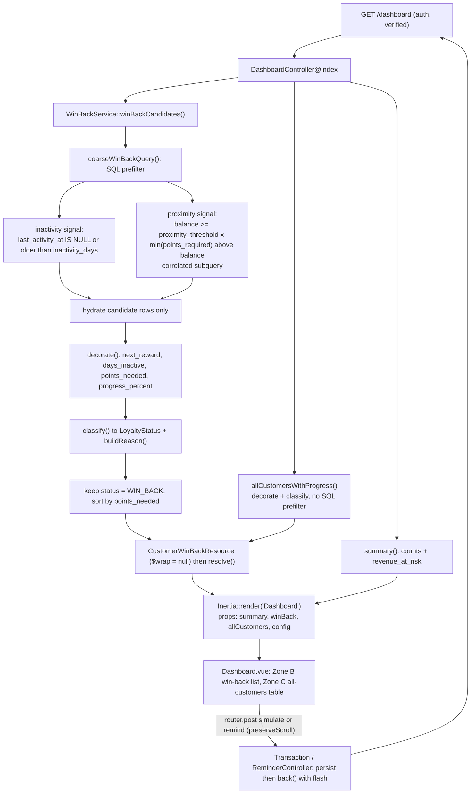

# Architecture

The mental model for how a request moves through this codebase. For why the
pieces are shaped this way (Inertia over a REST API, one service, the SQL
push-down, the payload contract), see `docs/DECISIONS.md` and the README. For
the tables and the demo dataset, see `docs/DATA_MODEL.md`. This file is how
they connect.

## 1. The Inertia request cycle

There is no separate JSON API. `bootstrap/app.php` only serialises responses
to JSON for `api/*` paths or requests that `expectsJson()`, and the app
defines no such route. Every response is therefore an Inertia page or a
redirect. The web middleware stack appends `HandleInertiaRequests`, which
shares `auth.user` and the `flash.success` / `flash.error` session values on
every page.

### Read path

`GET /dashboard` (middleware `auth`, `verified`; route name `dashboard`)
resolves to `DashboardController@index`. The controller method-injects
`WinBackService`, calls three service methods, and returns one
`Inertia::render('Dashboard', ...)` with these props:

| Prop | Source |
| --- | --- |
| `summary` | `$service->summary()` (counts and revenue at risk) |
| `winBack` | `CustomerWinBackResource::collection($service->winBackCandidates())->resolve()` |
| `allCustomers` | `CustomerWinBackResource::collection($service->allCustomersWithProgress())->resolve()` |
| `config` | `proximity_threshold` and `inactivity_days` from `config('loyalty.*')` |

`CustomerWinBackResource` sets `$wrap = null` and the controller calls
`resolve()`, so each list reaches the page as a plain array with no `data`
envelope.

### Write path

Two routes, both under `auth` only, both unnamed, both called by literal URL
from `Dashboard.vue` with `router.post(url, payload, { preserveScroll: true })`:

- `POST /customers/{customer}/simulate` to `TransactionController@store`.
  Validates with `SimulatePurchaseRequest`, computes
  `points = floor(amount * points_per_dollar)`, then one `DB::transaction`
  creates the `transactions` row, increments `points_balance`, and sets
  `last_activity_at` to now.
- `POST /customers/{customer}/remind` to `ReminderController@store`.
  Re-derives the candidate with
  `$service->winBackCandidates()->firstWhere('id', $customer->id)`. If it is
  no longer a win-back row it returns `back()->with('error', ...)` without
  writing. Otherwise it writes a `reminders` row with the candidate's
  `next_reward->id` and `$service->generateReminderMessage(...)`.

Both handlers end with `back()->with('success'|'error', ...)`. Inertia
follows the redirect back to `/dashboard`, `index` runs again, the two
signals are recomputed from current data, and fresh props replace the page.
There is no client cache to invalidate and no partial update to reconcile.

### Where the logic lives

`WinBackService` owns every rule: the coarse query, all thresholds (read
from `config('loyalty.*')`, never inline), the decoration of derived fields,
the `LoyaltyStatus` classification, the revenue-at-risk sum, and the reminder
copy.

The controllers receive, delegate, and return. `DashboardController` has no
branching. `TransactionController` does arithmetic and persistence only.
`ReminderController`'s single rule, the stale-candidate check, is delegated
to the service. On the frontend, `useWinBackDashboard` only sorts the list by
`points_needed` and exposes a count and an empty flag; the `formatters` and
`copy` modules are pure presentation. No business rule lives outside the
service.

## 2. The two-signal flow

The win-back segment is the intersection of a proximity signal and an
inactivity signal. It is computed in seven stages on every dashboard render.

1. **Entry.** `winBackCandidates()` is the main path. `summary()` calls it
   again for the count and the revenue sum. `allCustomersWithProgress()`
   feeds Zone C: it runs stages 4 and 5 over every customer with no coarse
   filter. The service holds no state, so the coarse query runs more than
   once per request.
2. **Coarse SQL filter.** `coarseWinBackQuery()` builds one Eloquent query
   with both signals applied in the database:
   - inactivity: `last_activity_at IS NULL` or `<= now - inactivity_days`;
   - proximity: a `whereRaw` keeping rows where `points_balance` is at least
     `proximity_threshold` times a correlated subquery for
     `min(points_required)` among rewards above the balance. A balance that
     meets every reward makes that subquery `NULL`, so the row is dropped.

   Both thresholds are passed as bindings from config. Indexes on
   `customers.last_activity_at` and `rewards.points_required` support this
   step (see `docs/DECISIONS.md`).
3. **Hydrate.** `get()` hydrates only the reduced candidate set. The rewards
   table is loaded once, ordered by `points_required`.
4. **Decorate.** `decorate()` attaches `next_reward` (smallest threshold
   above the balance, else `null`), `days_inactive` (whole days, or
   `PHP_INT_MAX` when `last_activity_at` is `null`), `points_needed`,
   `progress_percent` (clamped to 0 through 1), and the internal
   `closeToReward` and `inactive` booleans.
5. **Classify.** `classify()` returns a `LoyaltyStatus`: `NO_NEXT_REWARD`
   first; then `WIN_BACK` when close and inactive, ahead of `NEVER_ACTIVE`
   so a customer who never transacted but is close enough stays recoverable;
   then `NEVER_ACTIVE`, `ENGAGED_CLOSE`, `FADING_FAR`, `HEALTHY`.
   `buildReason()` attaches the plain-value breakdown of both signals.
6. **Final authority.** `winBackCandidates()` keeps only
   `status === WIN_BACK`, sorts by `points_needed` ascending, and reindexes.
   The SQL step is a prefilter; `classify()` decides membership.
7. **Serialise and render.** `CustomerWinBackResource` emits ten fields
   (`days_inactive` nulled for `NEVER_ACTIVE`, `status` as its string value,
   `next_reward` reduced to `name` and `points_required`). `resolve()`
   flattens the collection, `Inertia::render` sends it as the `winBack` and
   `allCustomers` props, and `Dashboard.vue` renders Zone B from `winBack`
   (re-sorted client-side by `useWinBackDashboard`) and Zone C from
   `allCustomers`. A write posts back and the whole chain reruns.

