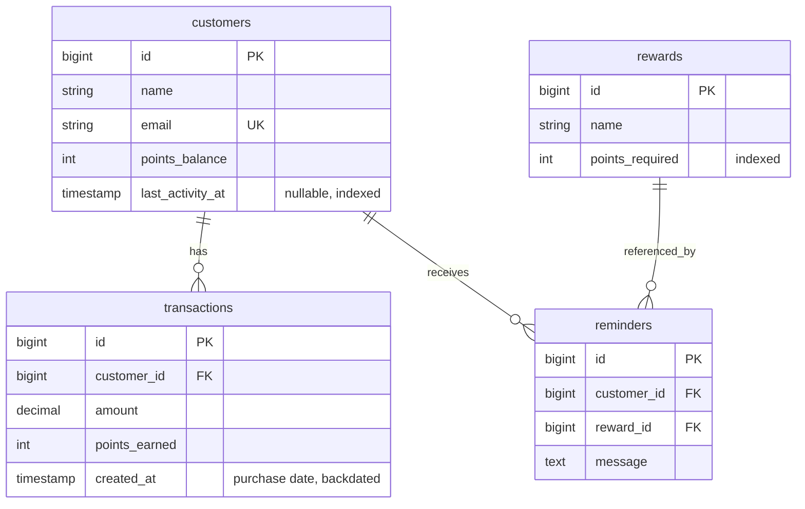

# Data Model

This document describes the four business tables (`customers`, `rewards`,
`transactions`, `reminders`), how they relate, and how the demonstration
seeder populates them. The reasoning behind the win-back rule itself (the
intersection of a proximity signal and an inactivity signal) lives in
`docs/DECISIONS.md` and is not repeated here.

## 1. Schema

### customers

| Column | Type | Notes |
| --- | --- | --- |
| id | bigint, primary key | |
| name | string | |
| email | string | unique |
| points_balance | unsigned integer, default 0 | current redeemable points, cast to integer. Set directly, not derived from `transactions`. |
| last_activity_at | timestamp, nullable | date of the most recent purchase, indexed. `null` means the customer has never transacted. Drives the inactivity signal. |
| created_at, updated_at | timestamps | |

### rewards

| Column | Type | Notes |
| --- | --- | --- |
| id | bigint, primary key | |
| name | string | |
| points_required | unsigned integer | points threshold to redeem, indexed. The "next reward" for a customer is the row with the smallest `points_required` strictly above that customer's `points_balance`. |
| created_at, updated_at | timestamps | |

### transactions

| Column | Type | Notes |
| --- | --- | --- |
| id | bigint, primary key | |
| customer_id | bigint, foreign key to `customers` | cascade on delete |
| amount | decimal(8,2) | purchase value |
| points_earned | unsigned integer | points granted by this purchase. With `loyalty.points_per_dollar = 1` this equals `amount` in the seed. |
| created_at | timestamp | the purchase date. The seeder backdates it, so it is not the row insert time. |
| updated_at | timestamp | |

### reminders

| Column | Type | Notes |
| --- | --- | --- |
| id | bigint, primary key | |
| customer_id | bigint, foreign key to `customers` | cascade on delete |
| reward_id | bigint, foreign key to `rewards` | no cascade |
| message | text | the nudge text shown or logged |
| created_at | timestamp | when the merchant sent the reminder |
| updated_at | timestamp | |

`reminders` is empty after seeding. Rows are written at runtime when a
reminder is sent from the dashboard.

### Relationships

- A `customer` has many `transactions` and has many `reminders`.
- A `transaction` belongs to one `customer`.
- A `reminder` belongs to one `customer` and references one `reward`.
- `Reward` declares no Eloquent relations. `rewards` is a small reference
  table that `reminders.reward_id` points at.
- The `2026_09_05_000001` migration indexes `customers.last_activity_at` and
  `rewards.points_required` so the coarse win-back filter can run in SQL. See
  `docs/DECISIONS.md` for why the filter is pushed into the database.

### Configuration that reads this data

`config/loyalty.php`:

| Key | Value | Role |
| --- | --- | --- |
| points_per_dollar | 1 | points granted per unit of `transactions.amount` |
| proximity_threshold | 0.80 | a balance at or above this fraction of the next reward threshold counts as close |
| inactivity_days | 14 | a `last_activity_at` older than this many days counts as inactive |

### Invariant the seeder maintains

For every seeded customer, the sum of `transactions.points_earned` equals
`points_balance`, and the most recent `transactions.created_at` equals
`last_activity_at`. The schema does not enforce either. `points_balance` and
`last_activity_at` are the authoritative columns, and the transaction rows
are built to agree with them.

## 2. Demonstration dataset

`DatabaseSeeder` runs only when `customers` is empty, an idempotence guard so
that running `--seed` on every container boot is safe. It creates one demo
login (`demo@kangaroo.test`, password `password`) and then calls
`LoyaltyDemoSeeder`, which builds the entire business dataset:

- one two-rung rewards ladder;
- 19 customers, arranged in groups that each land on one branch of the
  classifier;
- 36 transactions. Every customer except the never-active one gets two,
  dated 25 days apart, the later one on `last_activity_at`. For an odd
  balance the older transaction takes the smaller half.
- no reminders.

The arrangement is deliberate: the win-back list is a small subset of the
table, and each of the two signals can be seen failing on its own without
the other.

### Rewards ladder

| Reward | points_required |
| --- | --- |
| Free coffee | 100 |
| Free lunch | 300 |

So the 80 percent proximity line is 80 points for the coffee tier and 240
points for the lunch tier.

### Win-back candidates (5)

At or above 80 percent of the next reward and inactive for more than 14
days. These are the only customers the dashboard should surface. "Points to
reward" is the real shortfall to the next threshold, taken straight from the
seeder comment.

| Customer | Balance | Next reward (threshold) | 80% line | Points to reward | Days inactive |
| --- | --- | --- | --- | --- | --- |
| Emma Clarke | 92 | Free coffee (100) | 80 | 8 | 20 |
| Noah Bennett | 85 | Free coffee (100) | 80 | 15 | 30 |
| Ava Foster | 81 | Free coffee (100) | 80 | 19 | 15 |
| Liam Ortiz | 270 | Free lunch (300) | 240 | 30 | 18 |
| Sophia Reyes | 245 | Free lunch (300) | 240 | 55 | 25 |

Ranked by shortfall the order is Emma (8), Noah (15), Ava (19), Liam (30),
Sophia (55). Ava and Sophia are placed just inside both limits on purpose:
Ava clears the proximity line by 1 point and the inactivity limit by 1 day,
and Sophia clears the proximity line by 5 points.

### Close to a reward but still active (3)

Proximity signal satisfied, inactivity signal not. Must not appear in the
list.

| Customer | Balance | Next reward (threshold) | 80% line | Days since activity |
| --- | --- | --- | --- | --- |
| Mason Dupree | 95 | Free coffee (100) | 80 | 2 |
| Isabella Wren | 280 | Free lunch (300) | 240 | 5 |
| Ethan Marsh | 88 | Free coffee (100) | 80 | 1 |

Mason at 95 is closer to the coffee reward than Emma at 92, and Isabella at
280 is closer to the lunch reward than Liam at 270. Both are excluded purely
because they transacted within the last few days. This is the pair of rows
that proves the rule is an AND, not an OR.

### Inactive but far from a reward (3)

Inactivity signal satisfied, proximity signal not. Must not appear in the
list.

| Customer | Balance | Next reward (threshold) | Percent of threshold | Days inactive |
| --- | --- | --- | --- | --- |
| Olivia Hayes | 20 | Free coffee (100) | 20% | 45 |
| Lucas Bright | 150 | Free lunch (300) | 50% | 60 |
| Mia Sutton | 5 | Free coffee (100) | 5% | 90 |

Lucas has been inactive longer (60 days) than any win-back candidate, yet
sits at half of the lunch threshold, so no nudge is warranted. Inactivity on
its own does not make a customer recoverable.

### Ordinary active customers (6)

Mixed balances, all active within the last 7 days, none within 80 percent of
their next reward. They exist as realistic background so the win-back segment
is a minority of the table and so counts, sorting, and the value figure have
a non-trivial base.

| Customer | Balance | Next reward (threshold) | Days since activity |
| --- | --- | --- | --- |
| James Okafor | 40 | Free coffee (100) | 3 |
| Charlotte Nguyen | 60 | Free coffee (100) | 1 |
| Benjamin Voss | 110 | Free lunch (300) | 5 |
| Amelia Ross | 15 | Free coffee (100) | 4 |
| Henry Castillo | 200 | Free lunch (300) | 6 |
| Grace Whitfield | 70 | Free coffee (100) | 7 |

Grace at 70 of 100 sits just below the proximity line while active, the near
miss on that signal. Benjamin (110) and Henry (200) have already passed the
coffee threshold, so their next reward is the lunch tier: they show that
"next reward" follows the next uncleared rung, not the first one.

### Edge case: above every reward

William Park, balance 320, seeded 10 days out. Both thresholds (100 and 300)
are already cleared, so no `rewards` row sits above the balance and the next
reward is null. This customer can never be a win-back candidate regardless of
activity, and exercises the null-next-reward branch (`NO_NEXT_REWARD` in
`App\Enums\LoyaltyStatus`).

### Edge case: never transacted

Zoe Bramwell, created directly rather than through the helper.
`points_balance` 0, `last_activity_at` null, zero transactions. Exercises the
null activity branch and the empty join on `transactions` (`NEVER_ACTIVE`).

### What the dataset adds up to

- 2 rewards, 19 customers, 36 transactions, 0 reminders.
- Classifier coverage: 5 win-back, 3 close and active, 3 inactive and far, 6
  ordinary active, 1 above every reward, 1 never active.
- Because each seeded customer's transaction amounts sum to `points_balance`,
  the win-back segment's historical spend is 92 + 85 + 81 + 270 + 245 =
  773.00. `docs/DECISIONS.md` describes how `summary()` reports that figure
  as revenue at risk.
